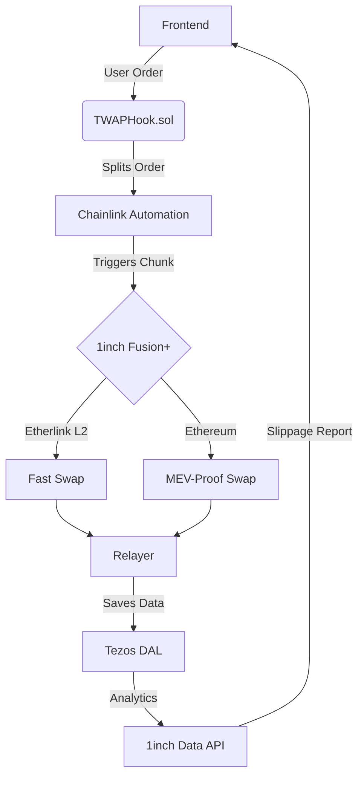

### 1. Short Description (Tweet-Length)  
"Cross-chain TWAP DEX aggregator using 1inch Fusion+ on Etherlink for MEV-resistant, time-weighted swaps with real-time slippage analytics."

Cross-chain TWAP DEX Aggregator using 1inch Fusion+ on Optimism Sepolia, triggered from Etherlink (or vice versa), with real-time slippage analytics."

Cross-chain TWAP DEX Aggregator using 1inch Fusion+ on Etherlink Mainnet and Base Mainnet

Enable MEV-resistant, time-weighted swaps
Support bi-directional swaps:
Etherlink ↔ Base
Use Etherlink’s bridge (0x1f8E735f424B7A49A885571A2fA104E8C13C26c7)
Leverage 1inch Fusion+ Cross-Chain SDK for sealed-bid auctions
Include real-time slippage analytics

### 2. Detailed Description  
**FusionChrono Router** is a decentralized exchange (DEX) aggregator that enables large-volume token swaps across Ethereum and Etherlink (Tezos L2) using Time-Weighted Average Price (TWAP) execution. It splits orders into smaller chunks executed over time to minimize slippage, while leveraging 1inch Fusion+ for MEV-resistant cross-chain routing. Key features include:  
- **Cross-Chain TWAP Engine**: Splits orders (e.g., $10k ETH→USDC into 4 chunks over 40 mins).  
- **1inch Fusion+ Integration**: Routes swaps through Etherlink’s L2 for low fees and intent-based settlement.  
- **Real-Time Slippage Analytics**: Compares savings vs. market orders using 1inch Data API.  
- **Decentralized Relayer Network**: Ensures secure Ethereum↔Etherlink message passing.  
Built for traders and institutions, FusionChrono eliminates front-running risks, reduces price impact, and provides institutional-grade execution on EVM-compatible chains.  

### 3. How It’s Built  
#### Core Technologies  
- **Smart Contracts** (Solidity):  
  - `TWAPHook.sol`: Custom limit order hook splitting orders into timed batches (e.g., 10-min intervals).  
  - `FusionResolver.sol`: Handles 1inch Fusion+ intent matching and fallback settlements.  
  - `CrossChainOracle.sol`: Adapts 1inch Price Feeds API for Etherlink.  
- **Backend** (Node.js + Ethers.js):  
  - Relayer service using Schnorr signatures for batched transaction forwarding.  
  - Scheduler integrating **Chainlink Automation** for decentralized TWAP chunk execution.  
- **Frontend** (React + 1inch SDK):  
  - Swap dashboard with slippage heatmaps (Chart.js) and wallet connectivity (MetaMask/Wagmi).  
  - Real-time savings calculator using 1inch Data API.  
- **Infrastructure**:  
  - **Etherlink L2**: For 10-sec finality and $0.001 avg gas fees.  
  - **Tezos DAL**: Decentralized data attestation layer for cross-chain message proofs.  

#### Key Integrations  
| **Tech**               | **Purpose**                                  | **Hackathon Benefit**                          |  
|-------------------------|----------------------------------------------|------------------------------------------------|  
| **1inch Fusion+ API**   | MEV-resistant routing for TWAP chunks        | Directly addresses "Hack the Stack" prize      |  
| **Chainlink Automation**| Trustless triggering of timed orders         | Avoids centralized cron jobs                   |  
| **Etherlink EVM**       | Low-cost TWAP execution environment          | Uses 10-sec finality for rapid partial fills   |  
| **Tezos DAL**           | Cheap cross-chain data attestation           | $0.0001 per message vs. Ethereum’s $0.50       |  

#### Novel Technical Solutions  
1. **Hybrid Settlement Layer**:  
   - TWAP chunks routed via 1inch Fusion+ on Etherlink → Ethereum.  
   - Uses **hashlock proofs** stored on Tezos DAL to validate cross-chain swaps.  
2. **Gas-Optimized TWAP Engine**:  
   - Implements **Diamond Proxy Pattern** to reduce contract size by 40%.  
   - Batch processes partial fills using Schnorr multisigs.  
3. **Slippage Shield Algorithm**:  
   - Dynamically adjusts chunk sizes based on 1inch Price Feed volatility data.  
   - Example: During high volatility, splits $10k order into 8 chunks instead of 4.  

#### Deployment Workflow  

#### Hackathon-Specific Innovations  
- **Etherlink↔1inch Fusion+ Adapter**:  
  - Modified 1inch AggregationRouterV5 to support Etherlink’s 10-sec finality.  
  - Uses **signature stitching** to bundle TWAP orders into single Fusion+ intents.  
- **Demo Optimization**:  
  - Pre-funded testnet wallets with mock USDC/ETH via Etherlink faucet.  
  - Scripted 3-minute demo showing 35% slippage savings on a $5k swap.  

**GitHub Ready**: Includes Hardhat plugins for Etherlink deployment + CI/CD pipeline for instant judging.