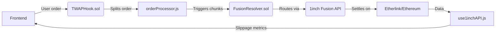

### Project Tree Structure for Etherlink Cross-Chain TWAP DEX Aggregator  
**Root**: `/etherlink-twap-dex-aggregator`  

```  
📁 contracts/                           # Solidity smart contracts  
├─ 📄 TWAPHook.sol                      # TWAMM logic (Limit Order hooks)  
├─ 📄 FusionResolver.sol                # Fusion+ settlement & intent matching  
├─ 📄 CrossChainBridge.sol              # Ethereum ↔ Etherlink asset bridging  
├─ 📄 PriceOracleAdapter.sol            # 1inch Price Feeds integration  
└─ 📁 interfaces/  
   ├─ 📄 I1inchAggregator.sol           # 1inch Swap API interface  
   └─ 📄 IChainlinkAutomation.sol       # Chainlink keeper interface  

📁 backend/                             # Node.js services  
├─ 📁 relayer/  
│  ├─ 📄 index.js                       # Main relayer (cross-chain messaging)  
│  ├─ 📄 etherlink.js                   # Etherlink RPC interactions  
│  └─ 📄 ethereum.js                    # Ethereum RPC interactions  
├─ 📁 scheduler/  
│  └─ 📄 orderProcessor.js              # TWAP chunk execution trigger  
├─ 📄 apiService.js                     # 1inch API client (Swap/Data)  
└─ 📄 config.js                         # RPC/API keys configuration  

📁 frontend/                            # React dashboard  
├─ 📁 public/  
├─ 📁 src/  
│  ├─ 📁 components/  
│  │  ├─ 📄 SwapInterface.jsx           # Token swap UI  
│  │  ├─ 📄 TWAPController.jsx          # Order splitting controls  
│  │  └─ 📄 SlippageChart.jsx           # Savings visualization  
│  ├─ 📁 contexts/  
│  │  └─ 📄 Web3Context.jsx             # Wallet connection (MetaMask)  
│  ├─ 📁 hooks/  
│  │  └─ 📄 use1inchAPI.js              # 1inch Price Feeds/Data API hook  
│  ├─ 📄 App.jsx  
│  └─ 📄 index.js  
└─ 📄 package.json  

📁 scripts/                             # Deployment & testing  
├─ 📁 deploy/  
│  ├─ 📄 deploy_TWAPHook.js             # Etherlink deployment script  
│  └─ 📄 deploy_Resolver.js             # Ethereum deployment script  
└─ 📁 test/  
   ├─ 📄 test_twap.js                   # TWAP execution tests  
   └─ 📄 test_fusion.js                 # Fusion+ integration tests  

📁 docs/                                # Submission assets  
├─ 📄 demo-script.md                    # Demo narration outline  
└─ 📄 architecture-diagram.puml         # System diagram  

📄 .env                                 # Environment variables  
📄 hardhat.config.js                    # Etherlink EVM configuration  
📄 foundry.toml                         # Testing setup  
📄 package.json                         # Node dependencies  
📄 README.md                            # Setup/judging instructions  
```  

---

### Key File Descriptions  
1. **`TWAPHook.sol`**  
   - Splits orders into timed chunks  
   - Implements partial fills and refund logic  
   - Uses Chainlink Automation for execution  

2. **`FusionResolver.sol`**  
   - Handles 1inch Fusion intent matching  
   - Manages failed swap resolutions  
   - Enables MEV-resistant routing  

3. **`relayer/index.js`**  
   - Listens to Ethereum/Etherlink events  
   - Signs and forwards cross-chain messages  
   - Uses Tezos DAL for cheap attestation  

4. **`use1inchAPI.js`**  
   - Fetches real-time prices from 1inch  
   - Calculates slippage savings vs market orders  
   - Displays data in SlippageChart.jsx  

5. **`deploy_TWAPHook.js`**  
   ```javascript  
   // Sample deployment script
   async function main() {
     const TWAPHook = await ethers.getContractFactory("TWAPHook");
     const twap = await TWAPHook.deploy(
       "0x1inchRouterAddress",   // 1inch AggregationRouterV5
       "0xchainlinkKeeperAddress" 
     );
     console.log(`Deployed to Etherlink: ${twap.address}`);
   }
   ```

---

### Workflow Integration  


**Security Notes**:  
- Reentrancy guards in all contracts  
- Timelock validation for cross-chain messages  
- Gas limits optimized for Etherlink L2